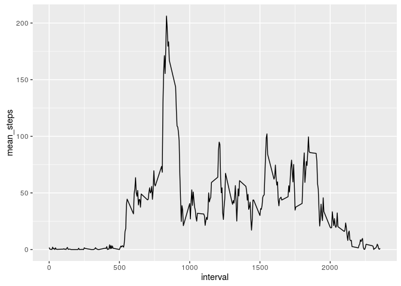
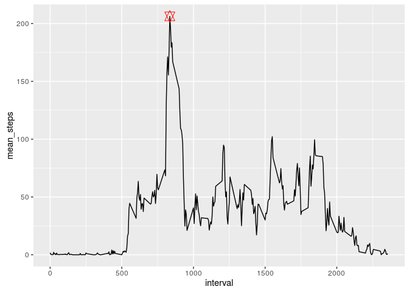
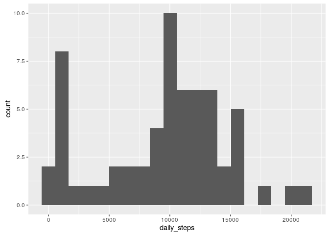
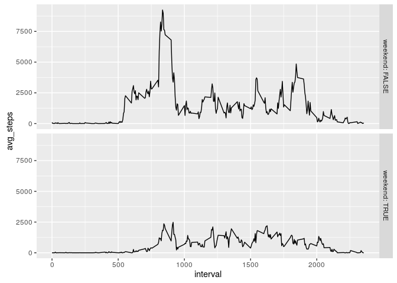

# Reproducible Research: Peer Assessment 1

## Source packages 
Install them if needed (TODO)

```
## 
## Attaching package: 'dplyr'
```

```
## The following objects are masked from 'package:stats':
## 
##     filter, lag
```

```
## The following objects are masked from 'package:base':
## 
##     intersect, setdiff, setequal, union
```


## Loading and preprocessing the data
Assume data is in the same directory as this script

1. If no csv, unzip first
2. Read csv 
3. Format date


```r
if (!any(grepl("activity.csv",list.files()))){
  unzip("activity.zip")
}

df <- read.csv("activity.csv")
```


## What is mean total number of steps taken per day?
Summarize steps per day with the dplyr package. Ignore missing data. 

1. Average daily steps
  a. group_by date 
  b. summarize dates using sum()
  c. summarize daily means using mean()


```r
avg_daily_steps <-  group_by(df, date) %>% 
                    summarize(daily = sum(steps, na.rm=TRUE)) %>%
                    summarize(mean_daily = mean(daily, na.rm = TRUE))
print(avg_daily_steps)
```

```
## # A tibble: 1 × 1
##   mean_daily
##        <dbl>
## 1    9354.23
```

2. Median daily steps
  a. group_by date 
  b. summarize dates using sum()
  c. summarize daily means using medain()
  

```r
med_daily_steps <-  group_by(df, date) %>% 
                    summarize(daily = sum(steps, na.rm=TRUE)) %>%
                    summarize(median_daily = median(daily, na.rm = TRUE))
print(med_daily_steps)
```

```
## # A tibble: 1 × 1
##   median_daily
##          <int>
## 1        10395
```


## What is the average daily activity pattern?

1. Create a time series plot of the averaged 5-minute activity patterns using the ggplot2 package.
  a. group_by interval
  b. summarize dates using mean(), ignoring missing data for now
  c. plot (type = "l")
  

```r
avg_interval_steps <- group_by(df, interval) %>%
                      summarize(mean_steps = mean(steps, na.rm=TRUE))

f <- ggplot(avg_interval_steps, aes(interval, mean_steps))
f <- f + geom_line()
f
```

<!-- -->

2. Find the 5 minute interval with the highest average step count. Add it to the plot for fun. 


```r
highest_avg_interval <- avg_interval_steps[which.max(avg_interval_steps$mean_steps), ]
print(highest_avg_interval)
```

```
## # A tibble: 1 × 2
##   interval mean_steps
##      <int>      <dbl>
## 1      835   206.1698
```

```r
f <- f + geom_point(data = highest_avg_interval, shape = 11 , size = 4, color = "red")
f
```

<!-- -->


## Imputing missing values

1. Calculate total number of NAs

```r
print(sum(is.na(df)))
```

```
## [1] 2304
```

2. Fill missing values
Fill the missing values using the average interval data that we computed before. Group the data by interval and check every value. If the interval is.na, then fill it with the median value (with na.rm) for that interval. If the interval is numeric, return the original step count. Note that if we choose to use the mean value, the imputed data steps would have different types: integer for the original, and numeric for the filled data.  

3. Create a new dataset with missing values filled in
  a. group by interval 
  b. if the interval is.na, fill it with the median_steps, otherwise leave it as it


```r
df_filled <- group_by(df,interval) %>%
             mutate(steps = ifelse(is.na(steps), median(steps, na.rm = TRUE), steps))
```

4. Make a histogram of the total steps each day. 
  a. group by date
  b. summarize with sum()
  c. make a histogram of daily steps

```r
total_daily_filled <- group_by(df_filled, date) %>% 
                      summarize(daily_steps = sum(steps))

a <- ggplot(group_by(total_daily_filled,date), aes(daily_steps))
a <- a + geom_histogram(bins=20)
a
```

<!-- -->

Calculate mean and meadian daily steps. Does this differ from before? How has imputing data impacted these measurements?

```r
avg_daily_steps_filled <- summarize(total_daily_filled, mean_steps = mean(daily_steps))
print(avg_daily_steps_filled)
```

```
## # A tibble: 1 × 1
##   mean_steps
##        <dbl>
## 1   9503.869
```

```r
med_daily_steps_filled <- summarize(total_daily_filled, median_steps = median(daily_steps))
print(med_daily_steps_filled)
```

```
## # A tibble: 1 × 1
##   median_steps
##          <int>
## 1        10395
```

This method of imputation has left the median number of steps per day intact (i.e. identical to the calculation with na.rm=TRUE). However, the avgerage daily steps calculation has moved up by over 100 steps. 

## Are there differences in activity patterns between weekdays and weekends?

1. Add a new factor variable to indicate weekend/weekdays using the weekday() function.
  a. use weekday() function and mutate to convert dates to days of week
  b. use mutate to make a weekend TRUE/FALSE factor variable


```r
df_weekend <- mutate(df_filled,day_of_week = weekdays(as.Date(date))) %>%
              mutate(weekend=as.factor(ifelse(day_of_week == "Sunday" | day_of_week == "Saturday", TRUE, FALSE)))
```

2. Make a panel plot containing time series plot of interval data, split between weekend and weekday 
  a. construct the avg interval steps data  for weekends and weekdays
  b. use ggplot2 to facet by weekend vs weekday


```r
avg_interval_steps_weekend <- group_by(df_weekend, interval) %>%
                              group_by(weekend, add=TRUE) %>%
                              summarize(avg_steps = sum(steps))
```


```r
t <- ggplot(avg_interval_steps_weekend, aes(interval, avg_steps))
t <- t + geom_line()
t <- t + facet_grid(weekend ~ ., labeller = label_both)
t 
```

<!-- -->

Overall there is much more activity, on average, on weekdays compared to weekends. And in particular, weekday mornings are far more active than any other period. 
